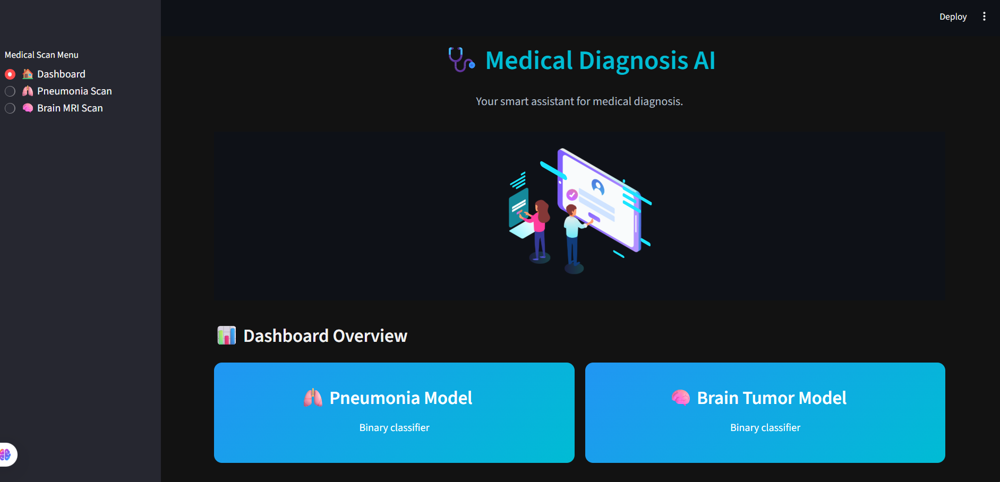
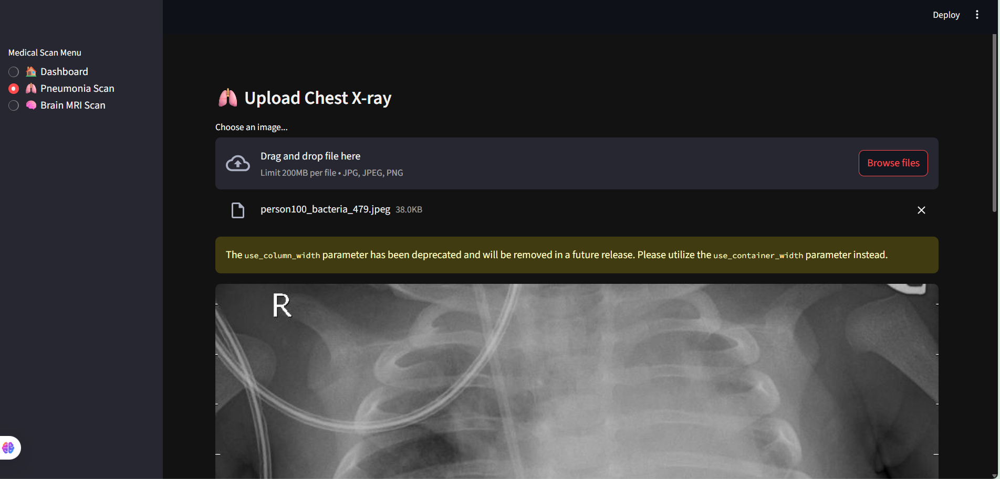
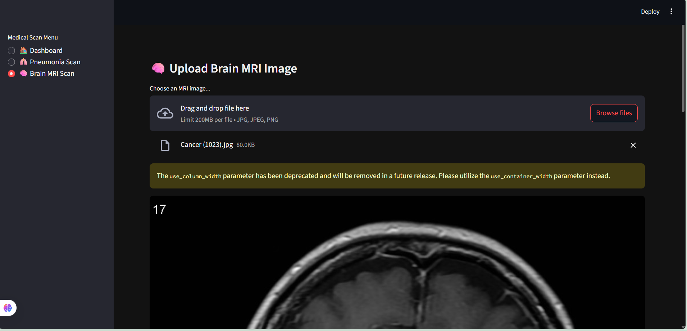

# 🩺 Medical Diagnosis AI Dashboard

A **Streamlit-based web application** that uses **CNN-based binary classifiers** to assist in early medical diagnosis from medical images. This app performs:

* **Pneumonia detection** from chest X-rays
* **Brain tumor detection** from MRI scans

It provides instant predictions with confidence scores, an intuitive dark-themed interface, and session history—all in a deployable web app.

---

## 🔗 Live Demo

👉 [Click here to access the live app](https://your-streamlit-cloud-link.streamlit.app)

> Deployed on **Streamlit Cloud**. No setup needed — just upload your image and get instant AI results.

---

## 🚀 Features

* 🔬 **Pneumonia Detection** using CNN (Pneumonia vs. Normal)
* 🧠 **Brain Tumor Detection** using CNN (Tumor vs. No Tumor)
* 📈 **Prediction History** stored per session
* 🎨 **Dark mode UI** with smooth Lottie animations
* 📊 **Confidence scores** visualized with progress bars
* 🖥️ **Streamlit-powered web UI**, mobile-friendly

---

## 🖼️ Screenshots

| Dashboard                                 | Pneumonia Scan                            | Brain MRI Scan                        |
| ----------------------------------------- | ----------------------------------------- | ------------------------------------- |
|  |  |  |

---

## 🧠 Models Used

* `Chest-xray_model.h5`: A CNN trained for binary classification (`Pneumonia` vs. `Normal`) from chest X-rays.
* `brain_tumour_model.h5`: A CNN for binary classification (`Tumor` vs. `No Tumor`) from brain MRI scans.

> Both models output a single probability score used to classify the input image.

---

## 🛠️ Installation & Running Locally

1. **Clone the repository:**

   ```bash
   git clone https://github.com/VINUTHNA1811/Medical-Diagnosis-AI.git
   cd Medical-Diagnosis-AI
   ```

2. **Install dependencies:**

   ```bash
   pip install -r requirements.txt
   ```

3. **Add model files** to the root directory:

   * `Chest-xray_model.h5`
   * `brain_tumour_model.h5`

4. **Run the app:**

   ```bash
   streamlit run app.py
   ```

---

## 📦 Project Structure

```bash
Medical-Diagnosis-AI/
├── app.py                    # Main Streamlit app
├── requirements.txt          # Python dependencies
├── Chest-xray_model.h5       # Pneumonia model
├── brain_tumour_model.h5     # Brain tumor model
├── screenshots/              # UI screenshots for README
│   ├── dashboard.png
│   ├── pneumonia.png
│   └── brain.png
└── README.md
```

---

## ✅ Usage Instructions

1. Choose the scan type from the sidebar.
2. Upload a supported image (`.jpg`, `.jpeg`, or `.png`).
3. View real-time predictions and confidence.
4. Review the recent prediction history on the dashboard.

---

## ⚠️ Medical Disclaimer

> **This tool is intended for educational and screening purposes only. It is not a substitute for professional medical advice, diagnosis, or treatment. Always consult a licensed healthcare provider.**

---

## 📬 Contact

For suggestions or collaboration, feel free to connect:

* 🔗 [LinkedIn - Budde Vinuthna](https://www.linkedin.com/in/budde-vinuthna-231642345)
